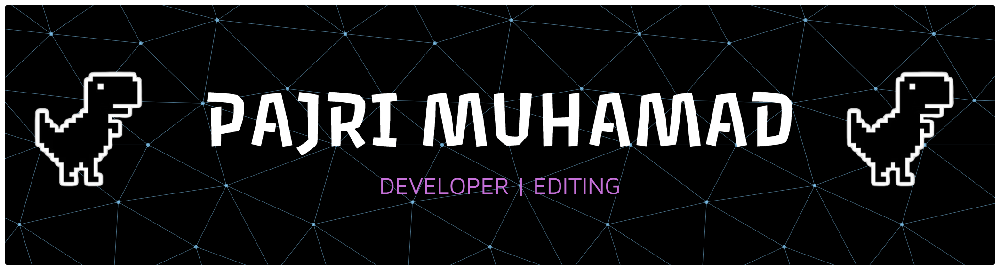

<h2 align="center">Hi sobat teknik info,kenalin nama saya pajri👋</h2>

---

<h2 align="center">ABOUT ME 👨🏻‍💻</h2>
<h7 align="center">

Nama saya Pajri, seorang pribadi yang penuh semangat dan selalu ingin belajar hal-hal baru. Saya senang menghabiskan waktu untuk beraktivitas, terutama yang bisa menjaga tubuh tetap sehat dan pikiran tetap segar.

Sejak kecil saya menyukai olahraga, terutama bulutangkis dan voli.
Dua olahraga itu bukan hanya sekadar hobi, tapi juga cara saya melatih fokus, kerja sama tim, serta semangat pantang menyerah. Setiap kali bermain, saya merasa lebih berenergi dan termotivasi untuk menjalani hari dengan penuh semangat.

Selain berolahraga, saya juga punya selera kuliner yang sederhana tapi khas — makanan favorit saya adalah somay . Rasanya yang gurih dan lembut selalu bikin saya ketagihan. Untuk minuman, saya paling suka Nutriboost, karena selain menyegarkan juga memberikan energi tambahan yang pas buat beraktivitas.

Saya juga sangat suka travelling . Bagi saya, bepergian ke tempat baru adalah cara terbaik untuk menambah pengalaman, mengenal budaya, dan melihat dunia dari sudut pandang yang berbeda. Setiap perjalanan selalu memberi pelajaran baru dan kenangan berharga yang membuat hidup terasa lebih berwarna.

Secara keseluruhan, saya adalah seseorang yang percaya bahwa hidup harus dijalani dengan semangat, rasa ingin tahu, dan keberanian untuk mencoba hal baru. Saya ingin terus berkembang, berbuat baik, dan menikmati setiap langkah perjalanan hidup ini. </h2>

---

<h2 align="center">MY STATS 📊</h2>

  
  

---

<h2 align="center">SKILL 🦾</h2>

###

 

  
  
  
  
  
 
  
  
  

---

<h2 align="center">CONNECT WITH ME 📡</h2>

<a href="https://www.youtube.com/@pajrimuhamad1792" target="_blank">
  

<a href="https://www.instagram.com/pjim02_/" target="_blank">
  

  

  

<a href="https://wa.me/qr/75WOL3RTPM3NB1" target="_blank">
    

---

<h2 align="center">GAME 🕹️</h2>
<!--  -->

<picture>
  <source media="(prefers-color-scheme: dark)" srcset="https://raw.githubusercontent.com/pajrimu02/pajrimu02/output/pacman-contribution-graph-dark.svg">
  <source media="(prefers-color-scheme: light)" srcset="https://raw.githubusercontent.com/pajrimu02/pajrimu02/output/pacman-contribution-graph.svg">
  
</picture>
